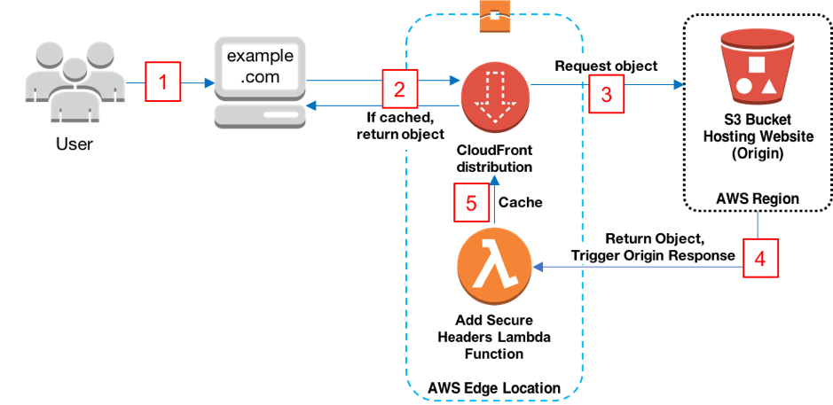

# Amazon CloudFront Secure Static Website
Use this solution to create a secure static website for your registered domain name. With this solution, your website:

- Is hosted on [Amazon S3](https://aws.amazon.com/s3/)
- Is distributed by [Amazon CloudFront](https://aws.amazon.com/cloudfront/)
- Uses an SSL/TLS certificate from [AWS Certificate Manager (ACM)](https://aws.amazon.com/certificate-manager/)
- Uses [Lambda@Edge](https://aws.amazon.com/lambda/edge/) to add security headers to every server response
- Is deployed with [AWS CloudFormation](https://aws.amazon.com/cloudformation/)

For more information about each of these components, see the **Solution details** section on this page.

## Solution overview

The following diagram shows an overview of how the solution works:



1. The viewer requests the website at example.com.
2. If the requested object is cached, CloudFront returns the object from its cache to the viewer.
3. If the object is not in CloudFront’s cache, CloudFront requests the object from the origin (an S3 bucket).
4. S3 returns the object to CloudFront, which triggers the Lambda@Edge origin response event.
5. The object, including the security headers added by the Lambda@Edge function, is added to CloudFront’s cache.
6. (Not shown) The objects is returned to the viewer. Subsequent responses for the object are served from the CloudFront cache.

## Prerequisites
You must have a registered domain name, such as example.com, and point it to a Route53 hosted zone in the same AWS account in which you deploy this solution. For more information, see [Configuring Amazon Route 53 as your DNS service](https://docs.aws.amazon.com/Route53/latest/DeveloperGuide/dns-configuring.html).

## Solution details

### S3 configuration
This solution creates an S3 bucket that hosts your static website’s assets. The website is only accessible via CloudFront, not directly from S3.

### CloudFront configuration
This solution creates a CloudFront distribution to serve your website to viewers. The distribution is configured with a CloudFront [origin access identity](https://docs.aws.amazon.com/AmazonCloudFront/latest/DeveloperGuide/private-content-restricting-access-to-s3.html) to make sure that the website is only accessible via CloudFront, not directly from S3. The distribution is also configured with a [Lambda@Edge function](https://docs.aws.amazon.com/AmazonCloudFront/latest/DeveloperGuide/lambda-at-the-edge.html) that adds security headers to every response.

### ACM configuration
This solution creates an SSL/TLS certificate in ACM, and attaches it to the CloudFront distribution. This enables the distribution to serve your domain’s website using HTTPS.

### Lambda@Edge configuration
This solution creates a Lambda@Edge function that’s triggered on an [origin response event](https://docs.aws.amazon.com/AmazonCloudFront/latest/DeveloperGuide/lambda-cloudfront-trigger-events.html). The function adds security headers to every response served by CloudFront.

The security headers can help mitigate some attacks, as explained in this blog post: [Adding HTTP Security Headers Using Lambda@Edge and Amazon CloudFront](https://aws.amazon.com/blogs/networking-and-content-delivery/adding-http-security-headers-using-lambdaedge-and-amazon-cloudfront/). Security headers are a group of headers in the web server response that tell web browsers to take extra security precautions. This solution adds the following headers to each response:

- [Strict-Transport-Security](https://infosec.mozilla.org/guidelines/web_security#http-strict-transport-security)
- [Content-Security-Policy](https://infosec.mozilla.org/guidelines/web_security#content-security-policy)
- [X-Content-Type-Options](https://infosec.mozilla.org/guidelines/web_security#x-content-type-options)
- [X-Frame-Options](https://infosec.mozilla.org/guidelines/web_security#x-frame-options)
- [X-XSS-Protection](https://infosec.mozilla.org/guidelines/web_security#x-xss-protection)
- [Referrer-Policy](https://infosec.mozilla.org/guidelines/web_security#referrer-policy)

For more information, see [Mozilla’s web security guidelines](https://infosec.mozilla.org/guidelines/web_security).

## Deploy the solution
To deploy the solution, you use [AWS CloudFormation](https://aws.amazon.com/cloudformation). You can use the CloudFormation console, or download the CloudFormation template to deploy it on your own.

> **Note:** You must have IAM permissions to launch CloudFormation templates that create IAM roles, and to create all the AWS resources in the solution. Also, you are responsible for the cost of the AWS services used while running this solution. For more information about costs, see the pricing pages for each AWS service.

The solution also involves setting the 
### Use the CloudFormation console

**To deploy the solution using the CloudFormation console**

1. Click the **Launch on AWS** button to open the solution in the CloudFormation console.

    [](https://console.aws.amazon.com/cloudformation/home?region=us-east-1#/stacks/new?stackName=amazon-cloudfront-secure-static-site-templates-main&templateURL=https://s3.amazonaws.com/solution-builders-us-east-1/amazon-cloudfront-secure-static-site/latest/main.yaml)

2. If necessary, sign in with your AWS account credentials.
3. You should see a **Create stack** page, with the fields specifying the CloudFormation template pre-populated. Choose the **Next** button at the bottom of the page.
4. On the **Specify stack details** page, enter values for the
   following fields:

    - **DomainName:** Your registered domain name, such as example.com. This domain must be pointed to a Route53 hosted zone.
    - **SubDomain:** The subdomain for your registered domain name. For example, for www.example.com the Subdomain is **www**.

   After entering values, choose the **Next** button.
5. On the **Configure stack options** page, you can optionally [add tags and other stack options](https://docs.aws.amazon.com/AWSCloudFormation/latest/UserGuide/cfn-console-add-tags.html). When finished, choose the **Next** button.
6. On the **Review** page, you must scroll down and check the two boxes in the **Capabilities** section:

    - **I acknowledge that AWS CloudFormation might create IAM resources with custom names.** 
    - **I acknowledge that AWS CloudFormation might require the following capability: CAPABILITY_AUTO_EXPAND**

    These capabilities allow CloudFormation to create an IAM role that allows access
   to the stack’s resources, and to name the resources dynamically.
7. Choose the **Create stack** button.
8. Wait for the CloudFormation stack to launch. When it’s launched, the **Status** changes to **CREATE_COMPLETE**.

### Download the CloudFormation template

To download the CloudFormation template to deploy on your own, for example by [using the AWS CLI](https://docs.aws.amazon.com/cli/latest/reference/cloudformation/create-stack.html), go to:

https://s3.amazonaws.com/solution-builders-us-east-1/amazon-cloudfront-secure-static-site/latest/main.yaml

### Updating the Project

If you would like to customise the project and upload your own static website content you can do so by following these steps

1. Ensure that you have npm installed.  See instructions [here](https://www.npmjs.com/get-npm)
2. Clone or download the project at [https://github.com/awslabs/aws-cloudformation-templates](https://github.com/awslabs/aws-cloudformation-templates)
3.  Package a build artefact by running the following at the command line

    ```shell
    make package-function
    ```
4. Copy your site content to the projects **www** folder
4. If you don't have one already, create an S3 bucket to store the CloudFormation artifacts with `aws s3 mb s3://<bucket name>`

5. Package the CloudFormation template. The provided template uses [the AWS Serverless Application Model](https://aws.amazon.com/about-aws/whats-new/2016/11/introducing-the-aws-serverless-application-model/) so must be transformed before you can deploy it.

    ```shell
    aws cloudformation package \
        --template-file templates/main.yaml \
        --s3-bucket <your bucket name here> \
        --output-template-file packaged.template
    ```

6. Deploy the packaged CloudFormation template to a CloudFormation stack:

    ```shell
    aws cloudformation deploy \
        --stack-name <your stack name> \
        --template-file packaged.template \
        --capabilities CAPABILITY_NAMED_IAM CAPABILITY_AUTO_EXPAND \
        --parameter-overrides  DomainName=<your domain> SubDomain=<your subdomain>
    ```

## Contributing
Contributions are welcome. Please read the [code of conduct](CODE_OF_CONDUCT.md) and the [contributing guidelines](CONTRIBUTING.md).

## License Summary
This project is licensed under the Apache-2.0 License.
