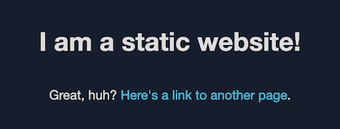

# Amazon CloudFront Secure Static Website

Use this solution to create a secure static website for your registered domain name. With this solution, your website:

- Is hosted on [Amazon S3](https://aws.amazon.com/s3/)
- Is distributed by [Amazon CloudFront](https://aws.amazon.com/cloudfront/)
- Uses an SSL/TLS certificate from [AWS Certificate Manager (ACM)](https://aws.amazon.com/certificate-manager/)
- Uses [CloudFront Response Header Policies](https://docs.aws.amazon.com/AmazonCloudFront/latest/DeveloperGuide/adding-response-headers.html) to add security headers to every server response
- Is deployed with [AWS CloudFormation](https://aws.amazon.com/cloudformation/)

For more information about each of these components, see the **Solution details** section on this page.

## Solution overview

The following diagram shows an overview of how the solution works:


1. The viewer requests the website at www.example.com.
2. If the requested object is cached, CloudFront returns the object from its cache to the viewer.
3. If the object is not in CloudFront’s cache, CloudFront requests the object from the origin (an S3 bucket).
4. S3 returns the object to CloudFront
5. CloudFront caches the object.
6. The object is returned to the viewer. Subsequent responses for the object are served from the CloudFront cache.

## Solution details

### S3 configuration

This solution creates an S3 bucket that hosts your static website’s assets. The website is only accessible via CloudFront, not directly from S3.

### CloudFront configuration

This solution creates a CloudFront distribution to serve your website to viewers. The distribution is configured with a CloudFront [origin access identity](https://docs.aws.amazon.com/AmazonCloudFront/latest/DeveloperGuide/private-content-restricting-access-to-s3.html) to make sure that the website is only accessible via CloudFront, not directly from S3. The distribution is also configured with a [CloudFront Response Header Policy](https://docs.aws.amazon.com/AmazonCloudFront/latest/DeveloperGuide/adding-response-headers.html) that adds security headers to every response.

### ACM configuration

This solution creates an SSL/TLS certificate in ACM, and attaches it to the CloudFront distribution. This enables the distribution to serve your domain’s website using HTTPS.

### CloudFront Response Header Policy

The CloudFront Response Header Policy adds security headers to every response served by CloudFront.

The security headers can help mitigate some attacks, as explained in the [Amazon CloudFront - Understanding response header policies documentation](https://docs.aws.amazon.com/AmazonCloudFront/latest/DeveloperGuide/understanding-response-headers-policies.html#understanding-response-headers-policies-security). Security headers are a group of headers in the web server response that tell web browsers to take extra security precautions. This solution adds the following headers to each response:

- [Strict-Transport-Security](https://infosec.mozilla.org/guidelines/web_security#http-strict-transport-security)
- [Content-Security-Policy](https://infosec.mozilla.org/guidelines/web_security#content-security-policy)
- [X-Content-Type-Options](https://infosec.mozilla.org/guidelines/web_security#x-content-type-options)
- [X-Frame-Options](https://infosec.mozilla.org/guidelines/web_security#x-frame-options)
- [X-XSS-Protection](https://infosec.mozilla.org/guidelines/web_security#x-xss-protection)
- [Referrer-Policy](https://infosec.mozilla.org/guidelines/web_security#referrer-policy)

For more information, see [Mozilla’s web security guidelines](https://infosec.mozilla.org/guidelines/web_security).

## Prerequisites

You must have a registered domain name, such as example.com, and point it to a Route 53 hosted zone in the same AWS account in which you deploy this solution. For more information, see [Configuring Amazon Route 53 as your DNS service](https://docs.aws.amazon.com/Route53/latest/DeveloperGuide/dns-configuring.html).

## Deploy the solution

> :⚠️ This template can only be deployed in the `us-east-1` region

To deploy the solution, you use [AWS CloudFormation](https://aws.amazon.com/cloudformation). You can use the CloudFormation console, or download the CloudFormation template to deploy it on your own.

> **Note:** You must have IAM permissions to launch CloudFormation templates that create IAM roles, and to create all the AWS resources in the solution. Also, you are responsible for the cost of the AWS services used while running this solution. For more information about costs, see the pricing pages for each AWS service.

### Use the CloudFormation console

**To deploy the solution using the CloudFormation console**

1. Click the **Launch on AWS** button to open the solution in the CloudFormation console.

   [](https://console.aws.amazon.com/cloudformation/home?region=us-east-1#/stacks/new?stackName=amazon-cloudfront-secure-static-site-templates-main&templateURL=https://s3.amazonaws.com/solution-builders-us-east-1/amazon-cloudfront-secure-static-site/latest/main.yaml)

2. If necessary, sign in with your AWS account credentials.
3. You should see a **Create stack** page, with pre-populated fields that specify the CloudFormation template. Choose the **Next** button at the bottom of the page.
4. On the **Specify stack details** page, enter values for the
   following fields:

   - **SubDomain:** The subdomain for your registered domain name. Viewers use the subdomain to access your website, for example: www.example.com. We recommend using the default value of **www** as the subdomain.
   - **DomainName:** Your registered domain name, such as example.com. This domain must be pointed to a Route 53 hosted zone.
   - **HostedZoneId** The Route 53 Hosted Zone Id containing the domain being used.
   - **CreateApex:** Optionally create an Alias to the domain apex (example.com) in your CloudFront configuration. Default is [no]

   After entering values, choose the **Next** button.

5. On the **Configure stack options** page, you can optionally [add tags and other stack options](https://docs.aws.amazon.com/AWSCloudFormation/latest/UserGuide/cfn-console-add-tags.html). When finished, choose the **Next** button.
6. On the **Review** page, you must scroll down and check the two boxes in the **Capabilities** section:

   - **I acknowledge that AWS CloudFormation might create IAM resources with custom names.**
   - **I acknowledge that AWS CloudFormation might require the following capability: CAPABILITY_AUTO_EXPAND**

   These capabilities allow CloudFormation to create an IAM role that allows access
   to the stack’s resources, and to name the resources dynamically.

7. Choose the **Create stack** button.
8. Wait for the CloudFormation stack to launch. The stack launches some nested stacks, and can take several minutes to finish. When it’s launched, the **Status** changes to **CREATE_COMPLETE**.
9. After the stack is launched, go to **www.example.com** to view your website (replace **example.com** with your domain name). You should see the website’s default content:

   

**To replace the website’s default content with your own**

1. Go to the [Amazon S3 console](https://s3.console.aws.amazon.com/s3/home).
1. Choose the bucket whose name begins with **amazon-cloudfront-secure-static-site-s3bucketroot-**.
   > **Note:** Make sure to choose the bucket with **s3bucketroot** in its name, not **s3bucketlogs**. The bucket with **s3bucketroot** in its name contains the content. The one with **s3bucketlogs** contains only log files.
1. In the bucket, delete the default content, then upload your own.

### Download the CloudFormation template

To download the CloudFormation template to deploy on your own, for example by [using the AWS CLI](https://docs.aws.amazon.com/cli/latest/reference/cloudformation/create-stack.html), go to:

https://s3.amazonaws.com/solution-builders-us-east-1/amazon-cloudfront-secure-static-site/latest/main.yaml

## Customizing the Solution

### Update the website content locally

**To customize the website with your own content before deploying the solution**

1. Install npm. For more information, go to https://www.npmjs.com/get-npm.
2. Clone or download this project from https://github.com/awslabs/aws-cloudformation-templates.
3. Run the following command to package a build artifact.

   ```shell
   make package-static
   ```

4. Copy your website content into the **www** folder.
5. If you don’t have one already, create an S3 bucket to store the CloudFormation artifacts. To create one, use the following AWS CLI command:

   ```shell
   aws s3 mb s3://<S3 bucket name>
   ```

6. Run the following AWS CLI command to package the CloudFormation template. The template uses the [AWS Serverless Application Model](https://aws.amazon.com/about-aws/whats-new/2016/11/introducing-the-aws-serverless-application-model/), so it must be transformed before you can deploy it.

   ```shell
   aws --region us-east-1 cloudformation package \
       --template-file templates/main.yaml \
       --s3-bucket <your S3 bucket name> \
       --output-template-file packaged.template
   ```

7. Run the following command to deploy the packaged CloudFormation template to a CloudFormation stack. To optionally deploy the stack with a domain apex skip this section and proceed to [Step 8] below.

   ```shell
   aws --region us-east-1 cloudformation deploy \
       --stack-name <your CloudFormation stack name> \
       --template-file packaged.template \
       --capabilities CAPABILITY_NAMED_IAM CAPABILITY_AUTO_EXPAND \
       --parameter-overrides  DomainName=<your domain name> SubDomain=<your website subdomain> HostedZoneId=<hosted zone id>
   ```

8. [Optional] Run the following command to deploy the packaged CloudFormation template to a CloudFormation stack with a domain apex.

   ```shell
   aws --region us-east-1 cloudformation deploy \
       --stack-name <your CloudFormation stack name> \
       --template-file packaged.template \
       --capabilities CAPABILITY_NAMED_IAM CAPABILITY_AUTO_EXPAND \
       --parameter-overrides  DomainName=<your domain name> SubDomain=<your website subdomain> HostedZoneId=<hosted zone id> CreateApex=yes
   ```

### Updating the site Response Headers

To change the Response Header Policy of the site:

1. Make your changes by editing ResponseHeadersPolicy in ./templates/cloudfront-site.yaml. Here you can modify any of the headers for Strict-Transport-Security, Content-Security-Policy, X-Content-Type-Options, X-Frame-Options, X-XSS-Protection, and Referrer-Policy. 
2. Deploy the solution by following the steps in [Update the website content locally](#update-the-website-content-locally)

## Contributing

Contributions are welcome. Please read the [code of conduct](CODE_OF_CONDUCT.md) and the [contributing guidelines](CONTRIBUTING.md).

## License Summary

This project is licensed under the Apache-2.0 License.
